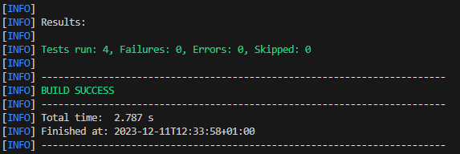
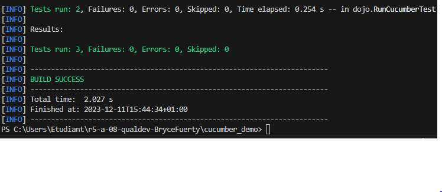

Ce dépôt concerne les rendus de mailto:bryce.fuertes@etu.univ-tlse2.fr[Bryce Fuertes].

== TP1

Contenu du fichier : is_it_friday_yet.feature

Feature: It is Friday yet?
    Everybody wants to know when it's Friday
     
    Scenario Outline: is it Friday ?
    Given today is "<day>"
    When I ask whether it's Friday yet
    Then I should be told "<answer>"
    Examples:
        | day            | answer |
        | Friday         | TGIF   |
        | Sunday         | Nope   |
        | anything else! | Nope   |

== TP2

Contenu du fichier : Order.java

        package dojo;

        import java.util.ArrayList;
        import java.util.List;

        public class Order {

            private String owner;
            private String target;
            private List<String> cocktails;
            private String message;

            public void declareOwner(String string){
                this.owner = string;
            }

            public void declareTarget(String string){
                this.target = string;
            }

            public List<String> getCocktails(int number){
                if (number ==0) {
                    this.cocktails = new ArrayList<String>();
                }else{
                    this.cocktails = new ArrayList<String>(number);
                }

                return this.cocktails;
            }
        }

== TP2
    
    ##Contenu du fichier : example.feature

    Feature: An example

    Scenario Outline: The example
        Given The file is : "<Fichier>"
        When The subject is "<Sujet>"
        Then The file should cite the subject

        Examples:
          | Fichier     | Sujet |
          | fichier.pdf | Programmation |
          | Tom         | Jerry    |

    ##Contenu du fichier : StepDefinitions.java

    public class StepDefinitions {
    
    FileSearch filePDF = new FileSearch();
    

    @Given("The file is : {string}")
    public void givenAFile(String fichier) {
        filePDF.setDirFile(fichier);
    }

    @When("The subject is {string}")
    public void allStepDefinitionsAreImplemented(String sujet) {
        filePDF.setSubjectFile(sujet);
    }

    @Then("The file should cite the subject")
    public void theFileSouldCiteTheSubject() {
        filePDF.verifyContent();
    }

}

    ##Objectif 

    L'objectif de ce test est de verifier la présence d'un sujet dans un rapport PDF

